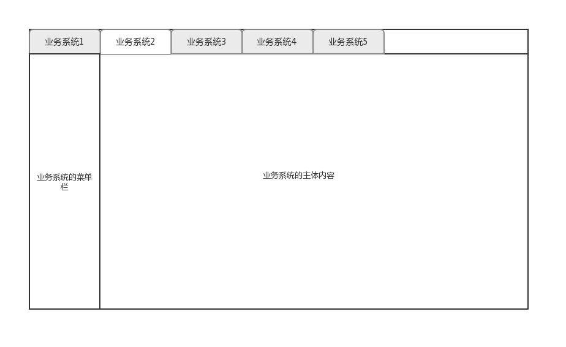

# 我的微前端实践

近一年来一直在进行公司内部系统的开发，主要包含财务和人事两大块，入口项目下也对应着多个子业务系统。页面结构如图：



系统一个个增加，伴随而来的前端代码也在飞快的增长。而在后端微服务的衬托下，前端单一大仓库的弊端也开始暴露出来。

1. 多业务系统并行开发，分支管理难度增加
2. 业务系统之间没有隔离`runtime`，可能会在不经意间相互影响
3. 特殊情况下全量回归几乎不可能实现
4. 打包容量大（可以通过`webpack`配置适当降低体积）

基于以上暴露出来的问题，我开始思考解决的办法。

---

## iframe

最开始想到的自然就是iframe。

将子业务系统拆分到独立的仓库，独立部署，然后在入口项目中通过iframe引入子系统。能够完美隔离运行时，丝毫不担心系统间的相互影响。然而这个方案有一个致命的缺陷，父子窗口之间的`url`是不同步的，也就意味着浏览器提供的后退前进等功能完全成为了摆设。不用去跟产品讨论也知道这个方案不可能过的，所以果断放弃。

## 微前端

这个概念其实早些时候就有听过，但是当时自己的业务场景与此技术基本无关，所以看过就忘了，最近查资料才想起来。

最具代表性的一个框架应该是[single-spa](https://github.com/CanopyTax/single-spa)。做了相关调查后，衡量再三，认为可以将它作为我们目前的解决方案。

以财务系统为例，其下包含5个子系统，代码是在同一个`git`仓库中的。将大仓库拆分为6个仓库，分别是入口项目`portal`，以及5个子系统各占1个。

然后先来处理`portal`项目。明确这个项目的职责，主要是处理登陆逻辑，以及子系统之间的切换，与业务相关的逻辑完全剥离。

```
<!-- index.html -->
<body>
  <div id="portal">
    <div id="header"></div>
    <div id="container">
      <div id="welcome"></div>
      <div id="error" style="display: none;"></div>
    </div>
  </div>
</body>
```

`dom`结构大概如上，`header`中包含了切换子系统的`tabbar`，`welcome`和`error`就是欢迎页与错误提示页面。

我们在`portal`项目的`main.js`中需要处理的逻辑如下：

1. 从配置中心获取项目所需的各类配置参数（由于`sso`的参数也在配置中心）
2. 与`sso`服务器交互完成登陆操作
3. 注册`single-spa`的子系统
4. 与子系统共享部分数据以及方法

```
// main.js
import Vue from 'vue';
import { getMountedApps, navigateToUrl } from 'single-spa';
import Element, { Loading, Message } from 'element-ui';
// other code here

// 全局数据通过该字段共享给子系统
window.$app = Object.create(null);
window.$methods = Object.create(null);

(async () => {
  const loading = Loading.service({ fullscreen: true, text: '正在初始化中' });
  try {
    await getConfig(); // 获取配置中心的配置参数
    await login(); // 处理登录逻辑
    await registerApplications(); // 注册子系统

    navigateToUrl('/welcome');

    // other code here

  } catch (err) {
    Message.error(err.message);
  }
  loading.close();
})();
```

那么接下来看以下注册子系统的逻辑，也就是`registerApplications`的逻辑。

```
// utils/registerApplications.js
import { Message, Loading } from 'element-ui';
import { start, registerApplication } from 'single-spa';
// other code here

// register applications here
export default function registerApplications() {
  // register applications here
  registerApplication('header', () => import('../components/header/index.js'), () => true);
  registerApplication('welcome', () => import('../components/welcome/index.js'), pathPrefix('/welcome'));
  registerApplication('error', () => import('../components/error/index.js'), pathPrefix('/error'));
}

function pathPrefix(prefix) {
  return function(location) {
    return location.pathname.indexOf(`${prefix}`) === 0;
  };
}

// other code here
```

可以看到以上只注册了`header`、`welcome`、`error`，这三个子系统，之前所说的5个子系统如何注册呢？它们分别在一个个独立的仓库，代码中根本无法引入啊。

关于这一点需要说些题外话，我们平时开发`web app`在使用`webpack`打包的时候都会将打包出来的`js`与`css`插入`html`中直接运行了。那么如果，我们打包的输出不需要`html`，并且将`js`打包成一个`umd`模块呢？

对了，我们的子系统的打包方案就是如此，具体到`webpack`配置应该是`output.libraryTarget`这个参数。我司业务开发的技术栈经过半年的调整和统一，现在都是用的`vue`。而基于`vue-cli3`则更简单：`vue-cli-service build --target lib ./src/lib.js`。开发阶段依旧用`./src/main.js`作为入口，然而打包的时候则另外写一个入口文件`./src/lib.js`。

```
// src/lib.js
import singleSpaVue from 'single-spa-vue';
import Vue from 'vue';
import App from './App.vue';
import router from './router';
import store, { SAVE_WEB_MAP, SAVE_AUTH, SAVE_USER_INFO, SAVE_DOMAIN_MAP } from './store';
import http from './http';
import './style/glob.scss';

Vue.use(http);

// 将入口项目挂载的数据存到store
store.commit(SAVE_AUTH, { token: window.$app.token, expiresAt: window.$app.expiresAt });
store.commit(SAVE_USER_INFO, window.$app.userInfo);
store.commit(SAVE_WEB_MAP, window.$app.webMap);
store.commit(SAVE_DOMAIN_MAP, window.$app.domainMap);

// 对入口项目暴露生命周期
const vueLifecycles = singleSpaVue({
  Vue,
  appOptions: {
    router,
    store,
    render: h => h(App),
    el: `#app-cc`,
  },
});
export const bootstrap = [vueLifecycles.bootstrap];
export const mount = [vueLifecycles.mount];
export const unmount = [vueLifecycles.unmount];
```

接着我们需要在`portal`项目做一些操作，生成子系统挂载时候的`dom`节点。

```
// utils/registerApplications.js
import { Message, Loading } from 'element-ui';
import { start, registerApplication } from 'single-spa';
// other code here

// register applications here
export default function registerApplications() {
  const appList = window.$app.apps;
  // create dom to mount app
  let container = document.getElementById('container');
  let fragment = document.createDocumentFragment();
  appList.forEach(({ name }) => {
    let div = document.createElement('div');
    div.id = `${name}-dom`;
    fragment.appendChild(div);
    div = null;
  });
  container.appendChild(fragment);
  container = null;
  fragment = null;

  // register applications code here
  registerApplication('header', () => import('../components/header/index.js'), () => true);
  registerApplication('welcome', () => import('../components/welcome/index.js'), pathPrefix('/welcome'));
  registerApplication('error', () => import('../components/error/index.js'), pathPrefix('/error'));
  
  appList.forEach(({ name, js, css, prefix, title }) => {
    registerApplication(
      name,
      () => {
        const loading = Loading.service({ fullscreen: true, text: `正在载入${title}` });
        return Promise.all([loadStyle(css), loadScript(js)])
          .then(() => {
            loading.close();
            return window[name];
          })
          .catch(() => {
            Message.error(`载入【${title}】系统失败`);
            loading.close();
          });
      },
      pathPrefix(prefix),
    );
  });

  start();
}

function pathPrefix(prefix) {
  return function(location) {
    return location.pathname.indexOf(`${prefix}`) === 0;
  };
}

// other code here
```

`window.$app.apps`是从哪里来的呢？其实这是在配置中心的，`portal`载入时的第一件事就是从配置中心获取各类配置参数，然后将一部分数据挂载到`window.$app`上共全局使用。

```
// utils/config.js
import _ from 'lodash';
import { _get } from '../http';

const { config_server_url, appId, clusterName, namespaceName } = JSON.parse(process.env.VUE_APP_CONFIG_CENTER);
const portalConfig = `${config_server_url}/configfiles/json/${appId}/${clusterName}/${namespaceName}`;
const commonConfig = `${config_server_url}/configfiles/json/webcommon/${clusterName}/${namespaceName}`;

export default function getConfigFromRemote() {
  return Promise.all([_get(portalConfig), _get(commonConfig)]).then(([{ data: portal }, { data: common }]) => {
    // 将获取到的配置挂载到 window.$app 上
    _.forEach({ ...portal, ...common }, function(value, key) {
      const _value = JSON.parse(value);
      // 将共享的数据 freeze 避免被修改
      window.$app[key] = Object.freeze(_value);
    });
  });
}
```

再来看一下`window.$app.apps`的结构是怎么样的

```
[{ name:'app-cc', title: '成本中心', "prefix": "/app/cc", js: 'http://cc_fake_path/app-cc.umd.js', css: 'http://cc_fake_path/app-cc.css' }]
```

至此`portal`项目注册子系统的流程已经通顺了。还需要注意的一点是子系统在开发的时候与打包的时候不是同一个入口。开发的时候由于没有`portal`项目注入一部分的配置，所以在开发的时候是需要自己去配置中心获取的。

```
// src/main.js
import Vue from 'vue';
import Element, { Message } from 'element-ui';
import ElTreeSelect from 'el-tree-select';
import config from './config';
import http from './http';
import App from './App.vue';
import router from './router';
import store from './store';
import login from './init/login';
import getConfig from './init/config';
import { dateFormatter, amountFormatter } from './utils/tools';
import './style/element-variables.scss';
import './style/page.scss';

// 开发环境入口
(async function() {
  try {
    await login();
    await getConfig();

    Vue.config.productionTip = false;

    Vue.use(http);
    Vue.use(Element, { size: 'small' });
    Vue.use(ElTreeSelect);

    Vue.filter('dateFormatter', dateFormatter);
    Vue.filter('amountFormatter', amountFormatter);

    new Vue({
      router,
      store,
      render: h => h(App),
    }).$mount(`#${config.dom}`);
  } catch (err) {
    Message.error(err.message);
  }
})();
```

子系统的`main.js`如上。

最后还有一个`css`方面的问题需要处理。由于业务系统之间可能会造成`class`名重复导致样式错乱，需要给子系统的`class`全都加上命名空间。`postcss`的插件可以为我们做到。

```
// postcss.config.js
module.exports = {
  plugins: {
    autoprefixer: {},
    'postcss-selector-namespace': {
      namespace: function(css) {
        // element-ui的样式不需要添加命名空间
        if (css.includes('element-variables.scss')) return '';
        return `.app-cc`;
      },
    },
  },
};
```

在`portal`项目中，切换子系统的时候需要为`body`添加上子系统的命名空间来使样式生效。

```
// main.js
import Vue from 'vue';
import { getMountedApps, navigateToUrl } from 'single-spa';
import Element, { Loading, Message } from 'element-ui';
// other code here

// 全局数据通过该字段共享给子系统
window.$app = Object.create(null);
window.$methods = Object.create(null);

(async () => {
  const loading = Loading.service({ fullscreen: true, text: '正在初始化中' });
  try {
    await getConfig(); // 获取配置中心的配置参数
    await login(); // 处理登录逻辑
    await registerApplications(); // 注册子系统

    navigateToUrl('/welcome');

    // 切换子系统的时候给body加上对应子系统的 class namespace
    window.addEventListener('single-spa:app-change', () => {
      const app = getMountedApps().pop();
      const isApp = /^app-\w+$/.test(app);
      if (isApp) document.body.className = app;
    });

  } catch (err) {
    Message.error(err.message);
  }
  loading.close();
})();
```

以上便是本次改版的基本轮廓，还有巨大的优化空间可以做。比如子系统之间其实有很多重复的依赖，其实可以通过`externals`在打包的时候排除，然后统一在`portal`项目中通过`cdn`引入。各个子系统之间的通信则可以通过全局事件总线来完成。

> 参考资料
> * [用微前端的方式搭建类单页应用](https://tech.meituan.com/2018/09/06/fe-tiny-spa.html)
> * [微前端的设计理念与实践初探](https://zhuanlan.zhihu.com/p/41879781)
> * [微前端的那些事儿](https://github.com/phodal/microfrontends)