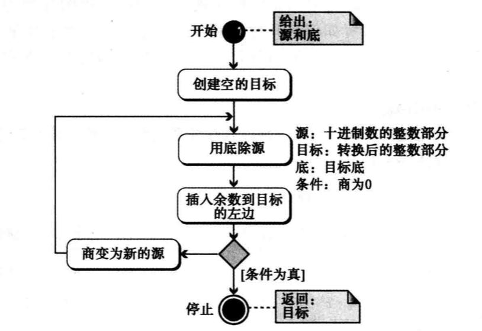
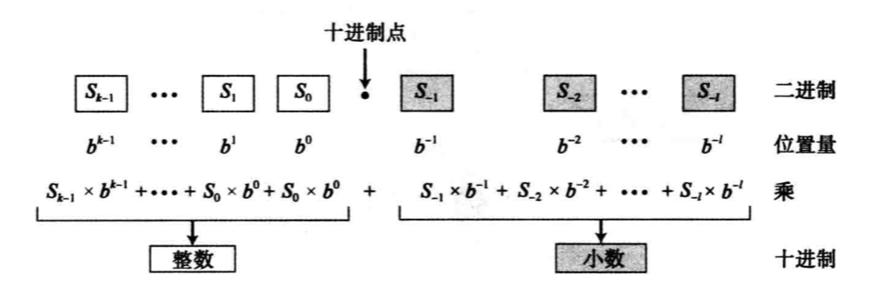
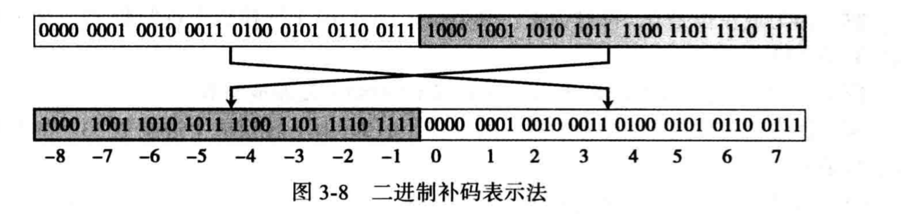

# 《计算机科学导论》笔记

最近在读《计算机科学导论》，想要对于编程了解更多，就免不了去了解计算机的底层知识。记录下阅读所感或总结，暂时不懂的也没关系，过段时间再读一遍或许有不一样的收获。

## 第一章 绪论

暂无

---

## 第二章 数字系统

### 十进制转换为二进制

该操作分为两个步骤，对整数部分与小数部分分开进行转换。先给出两个步骤的流程图。

**整数部分：**

**小数部分：**

以十进制数 6.25 为例转换为二进制数。

首先处理整数部分：

* 6 / 2 得 3 余 0
* 3 / 2 得 1 余 1
* 1 / 2 得 0 余 1

所以得到转换后的二进制整数部分为 110

接下来处理小数部分：

* 0.25 * 2 得 0.5 取整数部分 0
* 0.5 * 2 得 1 取整数部分 1

所以得到转换后的二进制小数部分为 01

最终结果为 110.01

### 二进制转十进制

相比起十进制转换为二进制，二进制转十进制更简单一些。

**流程图如下：**

以二进制数 1010.101 为例进行转换。(**表示幂运算)

* 整数部分为：`2**0 * 0 + 2**1 * 1 + 2**2 * 0 + 2**3 * 1 = 10`
* 小数部分为：`2**-1 * 1 + 2**-2 * 0 + 2**-3 * 1 = 0.625`

最终结果为 10.625

*八进制、十六进制转换为十进制，与二进制转换为十进制类似，唯一的不同就是底数。*

---

## 第三章 数据存储

### 如何存储数字？

1. 无符号表示法
2. 符号加绝对值表示法
3. 二进制补码表示法

目前几乎所有的计算机都采用**二进制补码表示法**来存储数字。

要了解**二进制补码表示法**需要先了解反码和补码的运算。

1. 反码：简单反转各个位，将0变为1，1变为0。例：10010 => 01101
2. 补码：补码有两种计算方法。例 10010 => 01110

   * 先进行一次反码计算，然后加1
   * 从最右侧开始复制位，直到有1被复制，接着对其余的位取反码

*二进制补码表示法*在存储数字的时候，有效范围为`0 ~ 2**n -1`，并且该范围会被划分为两个相等的子范围，左半边存储正整数，右半边存储负整数。最后，这两半会按照左负右正的习惯进行位置交换。书中图例如下：

然后来看二进制补码表示法具体是如何存储整数的。

* 存储

  1. 将整数转换为二进制数
  2. 如果整数是正的或者是零，直接存储。如果是负数，对其进行补码操作，然后存储

* 取出

  1. 如果最左位是1（负数），计算机对其进行补码操作，如果最左位是0（正数），不进行任何操作
  2. 将二进制数转换为十进制数（加上正负号）

### 扩展

[探寻 JavaScript 精度问题以及解决方案](https://juejin.im/post/5bb474166fb9a05cfc54e94d)

---

## 第四章